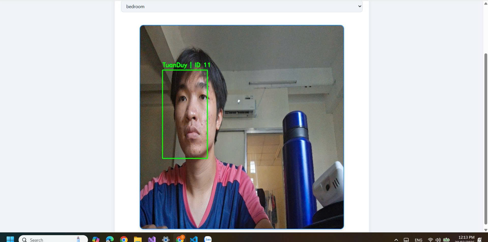

# 👤 faceRecognition – Real-Time Multi-Camera Face Recognition System

faceRecognition is a real-time face recognition system designed to enhance home security by detecting and recognizing authorized users from multiple cameras. The system includes anti-spoofing measures to prevent fake face attacks and features a ReactJS frontend for easy interaction.

The system can process multiple camera streams simultaneously, supporting both RTSP cameras and simulated mobile cameras.

---

# 🚀 Features

- Register new user face
- Recognize known users in real-time
- Anti-spoofing detection (detect fake faces via photos or printed images)
- Multi-face recognition
- Real-time camera recognition
- Multi-camera support
- Unknown person detection
- Logging recognition history

---

# 🧠 AI Models

## 1️⃣ RetinaFace + ArcFace (Buffalo Large)

- Purpose: Face detection and embedding extraction
- Pretrained, not retrained
- Embedding vector: 512 dimensions
- Cosine similarity used for recognition
- Recognition threshold: 0.6

## 2️⃣ Silent Face Anti-Spoofing

- Purpose: Detect whether a face is real or spoofed (photo, print, or screen)
- Stateless model integrated into the pipeline

---

# 🏗️ System Architecture

## Components

1. **Camera**
   - Supports RTSP cameras (simulated with mobile camera HTTP for current setup)
2. **Cam Backend**
   - Edge backend deployed in same LAN as cameras
   - Each camera has its own thread
   - Each thread contains 3 parallel sub-threads communicating via queues:
     - `capture_loop`: continuously pulls frames (every 0.3s) and sends to `detect_queue`
     - `detect_loop`: sends frame to AI Server for detection and recognition, receives response
     - `tracking_loop`: performs tracking using DeepSORT

3. **AI Server**
   - Stateless server
   - Steps per frame:
     1. Detect faces
     2. Crop faces
     3. Anti-spoofing detection (`fake -> skip`, `real -> process`)
     4. Compute embedding and cosine similarity for recognition
     5. Return list of Cam Backend URLs corresponding to the user account

4. **Frontend (ReactJS)**
   - Fetches camera URLs per user from AI Server
   - Displays selected camera stream with detection overlay
   - Registers new user faces:
     - Opens user camera
     - Capture button → send frame to AI Server
     - Frontend prompts for name input or skip

5. **Database**
   - JSON-based storage for registered user faces and recognition logs

---

# ⚙️ Tech Stack

**Python / AI Backend**

- insightface
- onnxruntime
- opencv-python
- numpy
- deep-sort-realtime

**PyTorch (CPU)**

- torch
- torchvision
- torchaudio

**Web / Backend**

- fastapi
- uvicorn
- python-multipart
- pydantic
- python-dotenv

**Frontend**

- ReactJS + Node.js
- Nodemon

---

# 📂 Project Structure

```text
faceRecognition/
│
├── models/                             # Models logic
│   ├── anti_spoofing.py                # Silent Face Anti-Spoofing module
│   └── recognition.py                  # Face recognition module
│
├── ai_server/                          # Backend AI server
│   ├── modules/
│   │   ├── face_recognition/
│   │   │   ├── backend/
│   │   │   │   ├── AI_backend.py       # AI server entrypoint
│   │   │   │   ├── CAM_backend.py      # CAM backend entrypoint
│   │   │   │
│   ├── requirements.txt                # Python dependencies
│
├── frontend/                            # ReactJS frontend
│   ├── src/
│   │   ├── pages/                       # Login, Dashboard, Register, etc.
│   │   ├── services/                    # Camera streaming & controls
│   │   └── styles/                      # Styling / Face registration components
│   ├── package.json
│
├── demo_img.jpg                         # Optional demo image for README
├── README.md
```

# ⚙️ Installation & Setup

## 1️⃣ Create Virtual Environment

```bash
python -m venv venv
```

Activate environment:

Linux / Mac:

```bash
source venv/bin/activate
```

Windows:

```bash
venv\Scripts\activate
```

## 2️⃣ Install Dependencies

```bash
pip install -r requirements.txt
```

## 3️⃣ Run AI Server

Open a terminal:

```bash
cd ai_server
uvicorn modules.face_recognition.backend.AI_backend:app --host 0.0.0.0 --port 8000
```

AI Server runs at: http://localhost:8000

## 4️⃣ Run Cam Backend

Open a new terminal:

```bash
cd ai_server
uvicorn modules.face_recognition.backend.CAM_backend:app --host 0.0.0.0 --port 9000
```

Cam Backend runs at: http://localhost:9000

## 5️⃣ Run Frontend

Open another terminal:

```bash
cd frontend
npm install
npm install -g nodemon  # if not installed globally
npm run dev
```

Frontend runs at: http://localhost:5173 (default Vite port)

# Demo

## 📹 Demo Video

Click the image below to watch the faceRecognition real-time demo:

[](https://drive.google.com/file/d/1aUYciKLTHvATIxVrCJjEnnTz07qJj4gi/view?usp=sharing)

> **Demo Login Note:**  
> Since the project does **not yet support account registration**, please use the following credentials to log in:
>
> - **Username:** `account`
> - **Password:** `123456789`

> **CAM URL Configuration:**  
> In `ai_server/modules/face_recognition/backend/CAM_config.yaml`, update the default URL:
>
> ```yaml
> url: "http://192.168.137.208:8080/video"
> ```
>
> to point to your own camera stream URL.

# 👨‍💻 Author

- **Nguyen Phan Tuan Duy** – AI Engineer Student, Ho Chi Minh City University of Technology (HCMUT)  
  GitHub: [https://github.com/nguyenphantuanduy](https://github.com/nguyenphantuanduy)

---

# 📄 License / Citation

This project uses the **Silent Face Anti-Spoofing** model from MiniVision AI. If you use this model in your research or project, please cite it according to the repository instructions.

- Silent Face Anti-Spoofing GitHub: [https://github.com/minivision-ai/Silent-Face-Anti-Spoofing.git](https://github.com/minivision-ai/Silent-Face-Anti-Spoofing.git)

BibTeX citation (example format if you reference in papers):

```bibtex
@misc{minivision2021silentface,
  author = {MiniVision AI},
  title = {Silent Face Anti-Spoofing},
  howpublished = {\url{https://github.com/minivision-ai/Silent-Face-Anti-Spoofing.git}},
  year = {2021}
}
```
